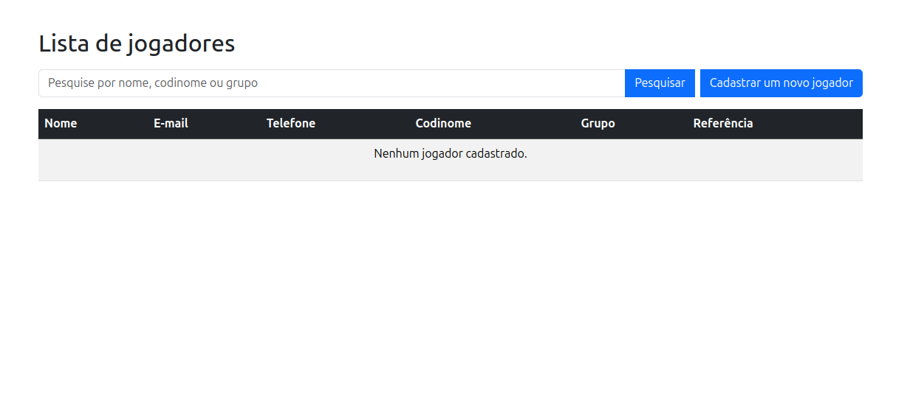
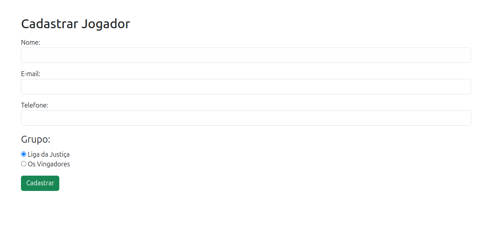
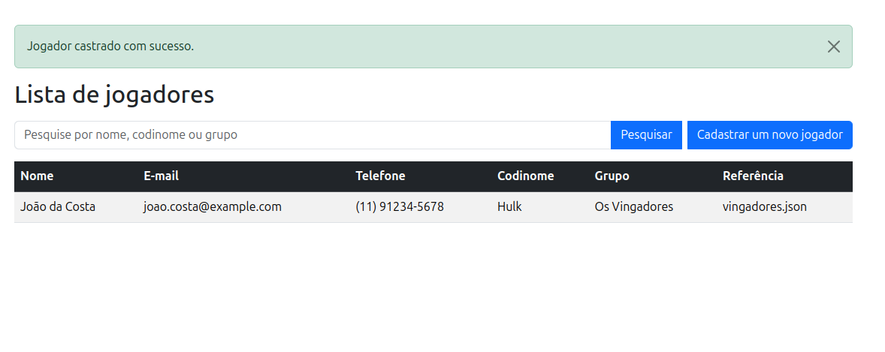
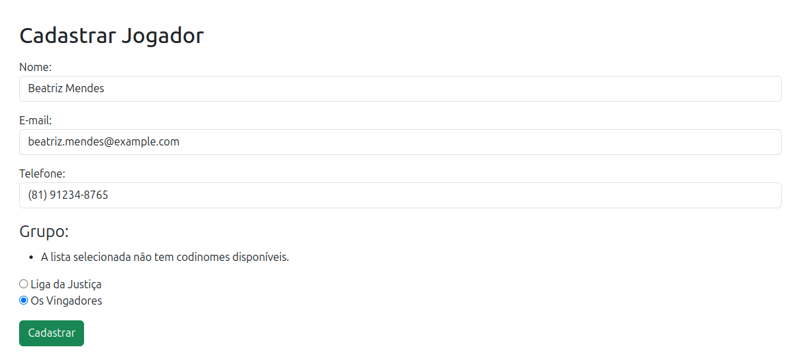
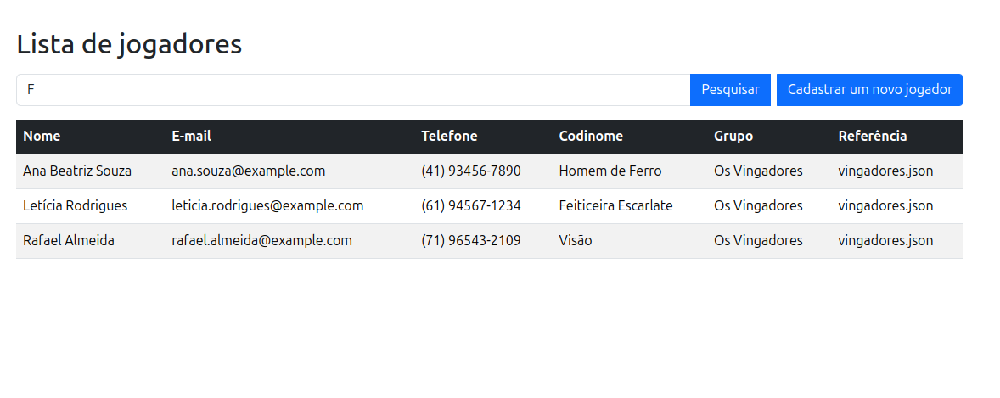
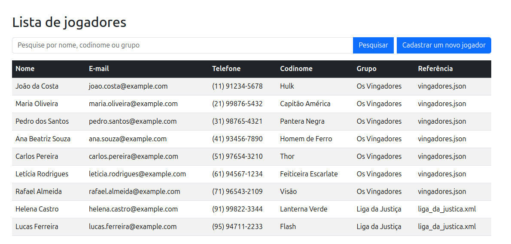

# Desafio Backend - UOL HOST

Este projeto é uma solução para o desafio técnico proposto pela UOL HOST com o objetivo de avaliar conhecimentos em programação backend, estrutura de dados, organização de código e consumo de dados externos.

> O desafio foi originalmente proposto em Java, mas como estou estudando Python, decidi adaptá-lo para essa linguagem.

Saiba mais sobre o desafio clicando [aqui](https://github.com/uolhost/test-backEnd-Java?tab=readme-ov-file)

---

## Objetivo

Criar uma aplicação backend capaz de:
- Cadastrar jogadores usando codinomes válidos, de acordo com listas externas (`liga_da_justica.xml` e `vingadores.json`)
- Armazenar dados em memória ou em arquivos
- Listar jogadores cadastrados
- Validar e impedir cadastros duplicados
- Classificar jogadores em "Os Vingadores" ou "A Liga da Justiça"

---

## Requisitos atendidos
- Leitura de arquivos XML e JSON externos via HTTP
- Validação de codinomes com base nas listas fornecidas
- Cadastro de jogadores com nome, e-mail e telefone
- Persistência em arquivo
- Listagem de todos os jogadores cadastrados
- Filtragem por grupo (Vingadores ou Liga da Justiça), nome do jogador e codinome
- Geração de relatório básico

---

## Demonstrações

Abaixo estão algumas imagens que ilustram o funcionamento da aplicação

### Nenhum jogador cadastrado

### Cadastro de jogador

### Cadastro de jogador com sucesso

### Sem codinomes disponíveis

### Filtrando por codinomes

### Relatório de usuários cadastrados

